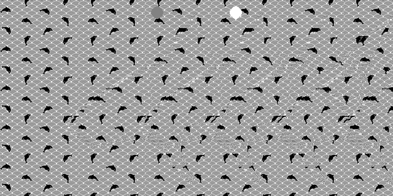

# Autostereograms

This program generates an [autostereogram](https://en.wikipedia.org/wiki/Autostereogram) based on a depth map!

<p align=center>
  
</p>

## Usage
```console
$ ./build.sh
$ ./build/autostereograms <depth-map.png> [pattern.png]
```

## Dependencies
* [raylib](https://www.raylib.com/)
